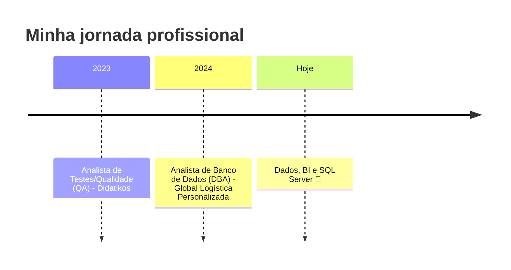

<!-- Troque SEU_USUARIO_GITHUB pelo seu usuário do GitHub (em todos os lugares) -->

 

## 👩‍💻 Sobre mim 

- 📍 Moro em **Uberlândia, Minas Gerais** 🇧🇷
- 💼 Sou **Analista de Banco de Dados (DBA)** na **Global Logística Personalizada**
- 🧠 Transformo desafios de negócio em soluções baseadas em dados
- ⚙️ Crio consultas, relatórios e automações que deixam os processos mais eficientes
- 🔍 Foco em informações **confiáveis e úteis** para tomadas de decisão
- 🌱 Sempre aprendendo coisas novas 💕
- 🤝 Vamos nos conectar!

## 💼 No meu dia a dia

| | O que eu faço |
|---|---|
| 🗄️ | Desenvolvimento, manipulação e otimização de dados em **SQL Server** |
| 📊 | Criação de dashboards e relatórios em **Power BI e no Sankhya** |
| 🔎 | Análise de dados para apoiar decisões de negócio |
| 🔌 | Integrações com **APIs** e automação de processos |
| ⚡ | Monitoramento e otimização de desempenho (consultas, índices e configurações) |

## 🛠️ Tecnologias e habilidades

 

| Nível | Tecnologias |
|-------|-------------|
| 🔥 **Avançado** | SQL Server, T-SQL, Power BI, DAX, Business Intelligence |
| 🌟 **Intermediário** | Python, Power Query, APIs (integração e consumo), Excel Avançado |
| 📚 **Conhecimentos** | ERP Sankhya, ETL, modelagem de dados, otimização de consultas, Git, metodologias ágeis |

## 🚀 Trajetória

**🗄️ Analista de Banco de Dados (DBA)** · Global Logística Personalizada
*Mar/2024 – atual*
Monitoramento e otimização de desempenho de bancos de dados, identificando melhorias e otimizando consultas, índices e configurações.

**🧪 Analista de Testes/Qualidade (QA)** · Didatikos
*Abr/2023 – Set/2023*

**🎓 Formação:** Estácio

## 📈 Estatísticas do GitHub

 

## 💬 Curiosidade do dia

## 📫 Vamos conversar!

 

* Obrigada por passar por aqui! 🩷*

  
  

